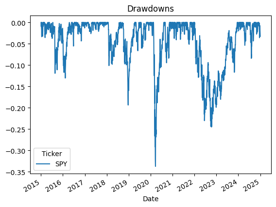

# Week 1 — Hello Finance (SPY Performance Analysis)

**Objective**  
Introduce basic financial data analysis by examining SPY (S&P 500 ETF).  
Tasks:  
- Download daily price data from Yahoo Finance.  
- Compute annualized return, volatility, Sharpe ratio, and maximum drawdown.  
- Visualize cumulative returns, drawdowns, and rolling volatility.  
- Overlay SMA(50/200) to illustrate a simple momentum signal.

---

## Data & Methodology
- **Instrument:** SPY (S&P 500 ETF)  
- **Period:** Jan 2015 – Jan 2025  
- **Frequency:** Daily adjusted close prices  
- **Assumptions:**  
  - Risk-free rate = 0% for Sharpe ratio  
  - Returns computed as daily % change  

---

## Results (Summary)

| Metric                | Value            |
|-----------------------|-----------------:|
| Annualized Return     | 14.81%           |
| Annualized Volatility | 17.62%           |
| Sharpe Ratio          | 0.78             |
| Max Drawdown          | –33.72%          |

---

## Visuals

### Cumulative Returns

### Drawdowns

### Rolling Volatility

### SMA(50/200) Overlay

---

## Interpretation
- **Returns:** SPY produced strong annualized returns over the sample.  
- **Volatility:** Risk clustered during crisis periods (COVID-19 in 2020, rate hikes in 2022).  
- **Drawdowns:** Maximum drawdown reached ~–33%, highlighting equity downside risk.  
- **Momentum (SMA):** Crossovers align with broad market regimes, but whipsaws appear.  

---

## Limitations & Next Steps
- Only one asset (SPY); no diversification.  
- Assumed 0% risk-free rate.  
- No transaction costs considered.  
- Next step (Week 2): Move to **equity factor analysis** (Momentum, Value).

---

**Repo:** [Week 1 Notebook](../notebooks/01_hello_finance.ipynb)