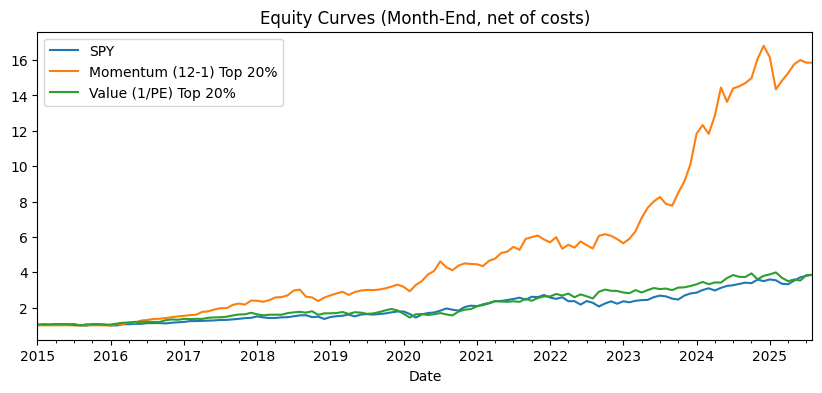
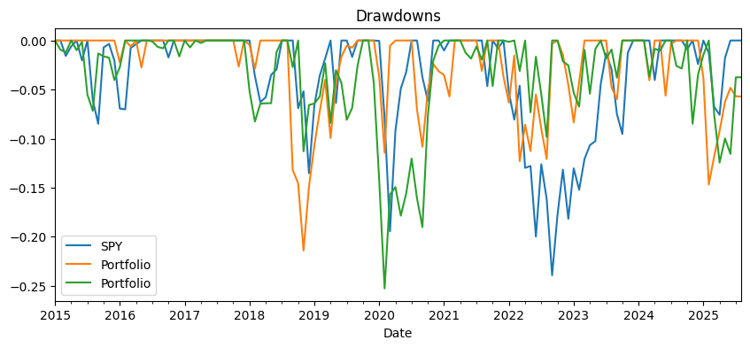

# Week 2 — Equity Factors I (Momentum 12-1 & Value Proxy)

**Objective**  
Construct and evaluate two classic cross-sectional equity factors:  
- **Momentum (12-1):** past 12 months’ return excluding the most recent month.  
- **Value (1/PE):** inverse trailing P/E as a simple value proxy.  
Compare long-only top-quintile portfolios against the SPY benchmark.

---

## Data & Methodology
- **Universe:** 20 US large-cap stocks (tickers listed in notebook).  
- **Period:** Jan 2015 – Jan 2025.  
- **Frequency:** Monthly (month-end prices).  
- **Factor definitions:**  
  - Momentum: \( P_{t-1} / P_{t-12} - 1 \).  
  - Value: inverse trailing P/E (from Yahoo Finance; snapshot-based).  
- **Portfolio construction:**  
  - Rank stocks cross-sectionally each month.  
  - Long equal-weight top 20% by factor score.  
  - Rebalance monthly.  
- **Costs:** 5 bps per round-trip trade.  
- **Benchmark:** SPY ETF.

---

## Results (Summary)

| Portfolio            | Ann.Return | Ann.Vol | Sharpe | Max Drawdown |
|----------------------|-----------:|--------:|-------:|-------------:|
| SPY (Benchmark)      |    14.94%  |  15.17% |   0.99 |      -23.93% |
| Momentum Top 20%     |    32.02%  |  18.71% |   1.71 |      -21.40% |
| Value (1/PE) Top 20% |    14.42%  |  16.00% |   0.90 |      -25.27% |

---

## Visuals

### Equity Curves

### Drawdowns

### Rolling Volatility (optional)

---

## Interpretation
- **Momentum:** The portfolio yields more than double SPY’s return. The volatility is higher than SPY, but not proportionally higher. The Sharpe ratio of 1.71 is outstanding; suggests strong risk-adjusted outperformance. The maximum drawdown is slightly smaller than SPY’s worst loss. Momentum not only boosted returns but did so efficiently, producing much better Sharpe. This aligns with the momentum premium found in academic studies (winners keep winning).
- **Value (1/PE):** The portfolio's annual return is close to SPY but has lower Sharpe (0.90) because of similar volatility but weaker returns. The maximum drawdown is worse than SPY. In this small universe and with a crude proxy (static 1/PE snapshot from Yahoo Finance), the value strategy didn’t add value. In fact, it slightly underperformed on a risk-adjusted basis. This mirrors real-world experience: Value has been weak over the last decade (growth stocks dominated, especially tech).
- **Comparison:** 	
  - Momentum clearly dominates: highest return, highest Sharpe, and drawdowns no worse than SPY.
	- Value struggled, showing the importance of robust factor definitions and larger universes.
	- Even a toy backtest shows how different factors behave, and that momentum was rewarded in the 2015–2025 period while value lagged.
- **Costs:** 5 bps per rebalance is modest; turnover could make this material in practice.

---

## Limitations & Next Steps
- **Value proxy:** Used a static trailing P/E snapshot; not time-varying.  
- **Universe:** Only 20 large-cap stocks — too small for robust factor testing.  
- **Data source:** Yahoo Finance fundamentals may be incomplete.  

**Next Week (Week 3):**  
- Add a **Quality factor** (profitability proxy).  
- Combine Momentum + Value + Quality into a **composite score**.  
- Explore **sector-neutral ranking**.

---

**Repo:** [Week 2 Notebook](../notebooks/02_equity_factors_mom_value.ipynb)